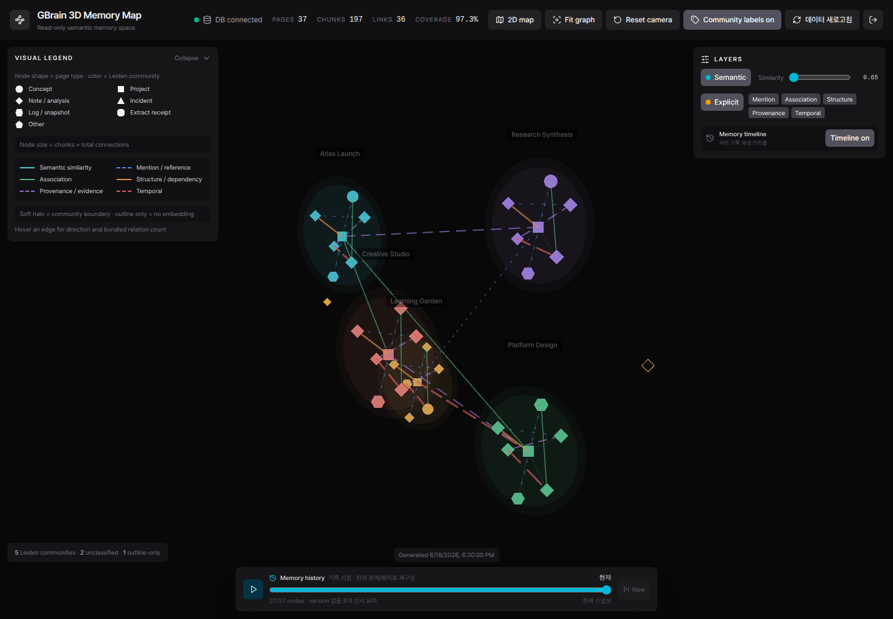

# GBrain 3D Memory Map

[한국어 문서](README.ko.md) | **English**



The screenshot uses the reproducible synthetic memory in [`demo/gbrain-demo-memory.ts`](demo/gbrain-demo-memory.ts). It contains no user memory, production metadata, credentials, or infrastructure identifiers.

A focused, read-only web app that visualizes pages from a local GBrain PostgreSQL/pgvector database as a semantic memory map. It supports switching between a 3D map and a dedicated, collision-aware 2D map. The browser communicates only with the Bun API and never receives database credentials, raw embeddings, or full page content.

## Stack

- Vite, React, TypeScript, Tailwind CSS, and shadcn/ui-style components
- Three.js and `react-force-graph-3d`
- Bun API and PostgreSQL/pgvector
- Deterministic 3D projection with `umap-js`
- Verified schema tables: `pages`, `content_chunks`, `links`, `tags`, and `sources`

The server exposes only three application endpoints:

```text
GET  /api/status
GET  /api/graph
POST /api/graph/rebuild
```

## Configuration

```bash
cp .env.example .env
```

Add the credentials for a read-only GBrain database role to `.env`. The file is excluded from Git.

```dotenv
GBRAIN_DB_HOST=127.0.0.1
GBRAIN_DB_PORT=5432
GBRAIN_DB_NAME=gbrain
GBRAIN_DB_USER=<read-only-user>
GBRAIN_DB_PASSWORD=<secret>
GBRAIN_DB_SCHEMA=public
GBRAIN_ALLOWED_SOURCE_IDS=default

LEIDEN_RESOLUTION=0.5
LEIDEN_MIN_SEMANTIC_SIMILARITY=0.65
LEIDEN_SEED=84

APP_HOST=127.0.0.1
APP_PORT=3000
APP_PUBLIC_ORIGIN=
APP_REBUILD_MIN_INTERVAL_SECONDS=15

APP_AUTH_PASSWORD=<password>
APP_SESSION_SECRET=<at-least-32-random-characters>
APP_AUTH_SESSION_HOURS=12
APP_AUTH_MAX_ATTEMPTS=5
APP_AUTH_ATTEMPT_WINDOW_MINUTES=15
```

`GBRAIN_ALLOWED_SOURCE_IDS` is a comma-separated allowlist. The server validates the schema identifier and applies both the source allowlist and `deleted_at IS NULL` to every snapshot query.

## Local development

```bash
bun install
bun run dev
```

The development UI runs at `http://127.0.0.1:5173`, and the API runs at `http://127.0.0.1:3000`.

For a production build:

```bash
bun run build
bun run start
```

In production, the Bun server serves both `dist/` and the API from the same origin.

The production app is protected by password authentication. After a successful login, the Bun server issues a signed HttpOnly session cookie with `SameSite=Strict`; `Secure` is also enabled when the public endpoint uses HTTPS. Neither the password nor the session signing key is sent to the browser or copied into an image layer. The Vite development server is intended only for loopback development, so run the production server when validating the authentication boundary. Login POST requests allow the configured same origin and the opaque `Origin: null` used by untrusted TLS exception pages. Logout and graph rebuild requests continue to require the same origin.

## Docker Compose

The local `.env` can contain the dedicated read-only PostgreSQL role used by the existing GBrain Dashboard, expressed as split environment variables. `.env` is excluded from both the Docker build context and Git.

```bash
docker compose up --build -d
docker compose ps
curl http://127.0.0.1:3100/healthz
```

The container listens on port 3000 and is published to `127.0.0.1:3100` by default. Ports 3000 and 3200 are already used by other services on the original host, so 3100 avoids a collision. Change only `APP_PUBLISHED_PORT` in `.env` to publish a different host port.

To inspect logs or stop the app:

```bash
docker compose logs -f web
docker compose down
```

The Compose service runs as a non-root user with a read-only root filesystem, dropped capabilities, `no-new-privileges`, and a restricted `/tmp` tmpfs. Database credentials are injected only through the runtime environment and are never copied into an image layer.

## Data pipeline

1. Pages tagged `brain-map`, which act as navigation/meta-index pages, are excluded from the page, embedding, and link queries. The source GBrain pages are not modified.
2. PostgreSQL `l2_normalize()` is applied to each chunk embedding.
3. The normalized chunk embeddings are averaged into one page embedding with `avg()`.
4. The same page-vector CTE generates each page's top two semantic edges using pgvector cosine distance (`<=>`).
5. Semantic and explicit edges are merged into one weighted, undirected graph. Reciprocal semantic edges are collapsed into one edge, and self-links are excluded from community detection.
6. Seeded Graphology Leiden produces communities used for node colors and halos.
7. A separate seeded UMAP projects page embeddings into three-dimensional display coordinates.
8. A page without an embedding still participates in its Leiden community when it has an explicit relation, but remains in the outer outline-only region.

The stable node ID is `source_id::slug`. Explicit edges preserve their original `link_type`, `link_source`, and direction, while all rendered lines remain straight and use no arrows. Direction is available in the hover tooltip as `source → target`. When multiple relations connect the same node pair, the highest-priority line is rendered and the tooltip lists all original relations.

The header's `Pages` and `Chunks` values describe the visible snapshot after excluding `brain-map` meta-index pages, not the unfiltered database totals.

## 3D and 2D map transition

The `2D map` button does more than set the existing Z coordinates to zero. Flattening the 3D coordinates directly would make nodes and communities that were separated by depth overlap, so the app computes a separate deterministic 2D layout.

- Within each Leiden community, the layout resolves 2D collisions using the sum of billboard radii plus 0.8 units of spacing.
- It computes a circle that encloses each community halo, then packs the communities with at least 14 units between their circles.
- An isometric projection of the original 3D coordinates seeds the 2D positions, preserving the communities' approximate relative directions.
- Unclassified and embedding-free outline-only nodes are placed on collision-free rings outside the packed communities.
- Coordinates with the same stable node ID are interpolated over 1.05 seconds with cubic ease-in-out. Edge endpoints, halo centers and radii, and label anchors are updated on every animation frame.
- The transition does not call a full ForceGraph `refresh()`. Nodes temporarily become a single point batch with shape, color, and size attributes; semantic and explicit edges each become one line batch; and community halos become two low-poly merged meshes for the inner and outer layers. The original billboards, weighted relation lines, and interactive halo objects are restored immediately after the transition.
- `nodeThreeObject` and `linkThreeObject` accessors retain stable function identities across mode and resize renders. Switching modes therefore does not make ForceGraph replace existing node or edge objects, and every morph starts from the currently displayed coordinates instead of an estimated flatness state.
- Community label dimensions are measured once and then moved with compositor-backed `translate3d()` transforms. Diagnostic `data-morph-*` attributes report morph FPS after excluding long browser stalls and indicate whether batching is active.
- In 2D mode, the camera moves to a front-facing planar view and only rotation is locked. Zoom, pan, node and edge hover, selection, and community focus remain available.
- Switching back with the `3D map` button restores the original server-provided UMAP/Leiden 3D coordinates and the isometric camera using the same morph pipeline.

The smoke test exhaustively checks node-surface spacing and community-halo spacing in the final 2D layout against the production graph. The 2D layout exists only in the browser and never writes coordinates to the API response or GBrain database.

Relation lines are distinguished by pattern and width:

| Relation | Pattern | Width |
| --- | --- | ---: |
| Temporal evolution | Long dash | 3.0px |
| Structure / dependency | Solid | 2.6px |
| Provenance / evidence | Short dash | 2.0px |
| Association | Solid | 1.6px |
| Mention / reference | Dotted | 1.1px |
| Semantic similarity | Solid | 0.6px |

Semantic edges below `LEIDEN_MIN_SEMANTIC_SIMILARITY` are excluded from Leiden input. Retained semantic edges are linearly scaled from a weight of 0.25 at the threshold to 1.0 at a similarity of 1. Explicit weights are 0.35 for mention, 0.9 for association, 1.4 for hierarchy, 1.25 for provenance, and 1.1 for temporal relations; evidence between the same node pair is combined. On the real database matrix, the defaults of `resolution=0.5` and a 0.65 threshold produced more than 99% partition agreement across seeds without creating excessively large communities.

Only pages with no retained relation are shown as `unclassified`. The tooltip's `internal-edge share` is the proportion of a node's total Leiden input edge weight that connects to nodes in the same community; it is not a Leiden membership probability. The layout preserves each community's internal 3D UMAP coordinates while relaxing centroid spacing and minimum node spacing. A low-intensity halo marks each community's 3D bounding volume.

When `Labels` is enabled, one community label appears at the screen-space top-center of the outer halo instead of showing every node title. Labels contain only the community title, without `Leiden NN` or node counts, and the `No retained relation` label is hidden. Text and black backgrounds have low opacity by default. Pointing inside a halo brightens it without changing its bounds and makes that group's label fully opaque and white. All nodes in the hovered community and directly connected one-hop nodes are emphasized with the same opacity and a 1.1× scale; unrelated nodes, halos, and labels are dimmed. Label position updates are limited to once per frame and snapped to integer pixels to prevent jitter while moving the camera.

Nodes use `THREE.Sprite` billboards instead of solid 3D meshes, so each 2D shape always faces the camera.

| Page type | Billboard shape |
| --- | --- |
| `concept` | Circle |
| `project`, `project_note` | Square |
| `note`, `analysis`, `guide` | Diamond |
| `incident`, `incident-followup` | Triangle |
| `project-log`, `ops-snapshot`, `infrastructure-snapshot` | Hexagon |
| `extract_receipt` | Octagon |
| Unknown type | Pentagon |

Each shape uses its semantic-group color with a thin black border. Nodes without embeddings use an unfilled dashed outline. A selected node keeps its color and receives a white outline and 1.12× scale. The default node-radius multiplier is 0.675, exactly half the earlier billboard size. Collision relaxation uses the sum of each pair's visual radii plus 0.8 units. `No retained relation` nodes use amber `#E8A838`; regardless of embedding coverage, they are distributed evenly on nearby rings with radii of roughly 68–76 before the final all-node collision pass. Billboards at different depths can still overlap in screen space depending on the camera projection.

## Read-only access and external exposure

Snapshot generation begins with `SET TRANSACTION READ ONLY`. The production database role should receive only `SELECT` on the required tables and no `INSERT`, `UPDATE`, or `DELETE` privileges.

The default `APP_HOST=127.0.0.1` is intentional. Do not bind Bun directly to the public internet; place a reverse proxy on the same host in front of it. Password authentication is the app's baseline defense, and the reverse proxy must also provide TLS. Add proxy-level OIDC or a VPN when stronger access control is required. Because the graph snapshot itself can contain private memory metadata, `/api/status`, `/api/graph`, and `/api/graph/rebuild` all require an authenticated session. The public `/healthz` endpoint returns only `ok`, without status details or database information.

Caddy example:

```caddyfile
memory.example.com {
  encode zstd gzip
  # Add forward_auth or your organization's OIDC integration if needed.
  reverse_proxy 127.0.0.1:3100
}
```

Nginx example:

```nginx
server {
  listen 443 ssl http2;
  server_name memory.example.com;

  # Configure ssl_certificate and ssl_certificate_key; add auth_request or a VPN if needed.
  location / {
    proxy_pass http://127.0.0.1:3100;
    proxy_http_version 1.1;
    proxy_set_header Host $host;
    proxy_set_header X-Forwarded-Proto $scheme;
    proxy_set_header X-Forwarded-For $proxy_add_x_forwarded_for;
  }
}
```

When using an external origin, set `APP_PUBLIC_ORIGIN=https://memory.example.com` in `.env`. The server validates the origin of rebuild POST requests and applies a 15-second rate limit by default. Responses also include a content security policy, frame denial, MIME sniffing protection, referrer and permissions policies, and HSTS when HTTPS forwarding is detected.

## Tests

```bash
bun test tests/community.test.ts tests/layout.test.ts tests/style.test.ts
APP_AUTH_PASSWORD='<configured-password>' SMOKE_BASE_URL=http://127.0.0.1:3000 bun test tests/smoke.test.ts
APP_AUTH_PASSWORD='<configured-password>' PLAYWRIGHT_BASE_URL=http://127.0.0.1:3000 bunx playwright test
```

The real-database smoke test verifies node/page counts, embedded and unembedded separation, stable IDs, semantic top-two edges, explicit-edge preservation, and the absence of sensitive fields in API responses. Playwright checks console errors, failed requests, and horizontal or vertical overflow at 1440×1000, 1920×1200, and 2560×1600, then writes screenshots and isolated morph FPS results to `screenshots/morph-performance.json`. It also validates the actual Three.js scene rather than only React coordinates: scene-node Z depth, node coordinate error, halo center and containment errors, and camera axes across the complete 3D→2D→3D cycle.

README demo screenshots are rendered by the real WebGL UI with the synthetic fixture. Regenerate them with `bun run capture:readme-demo`.

- [Synthetic 3D overview](screenshots/gbrain-demo-memory-map.png)
- [Synthetic 2D map](screenshots/gbrain-demo-memory-map-2d.png)
- [Synthetic node focus](screenshots/gbrain-demo-memory-map-focus.png)

## Known limitations

- Coordinates and communities are cached in process memory and recomputed on the first request after a restart.
- The layout uses fixed seeds, but changing the `umap-js` version can still change the result.
- Leiden community labels are short descriptions derived from the community's dominant tags and page types.
- Leiden results can change when the semantic threshold, relation weights, resolution, or graph corpus changes.
- A fallback for browsers without WebGL is outside the scope of this focused map MVP.
- Authentication uses one shared password; per-user accounts, role separation, and a password-reset UI are not provided.
